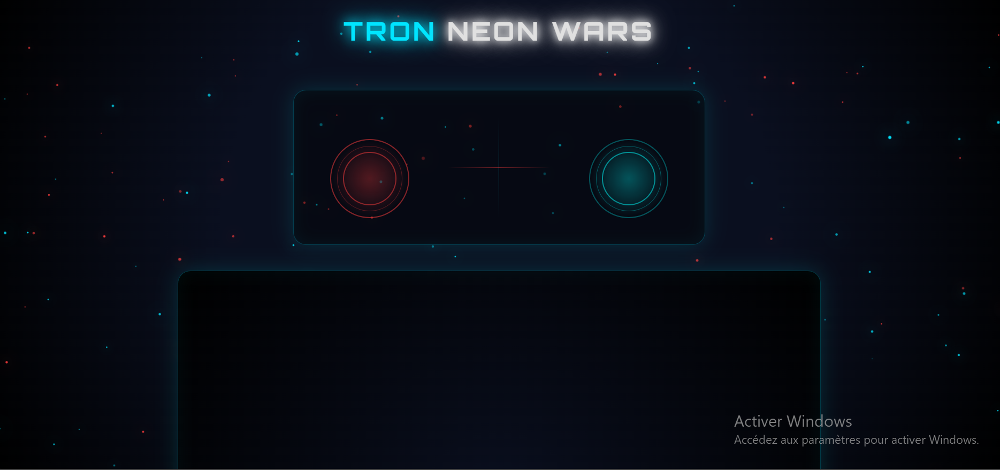
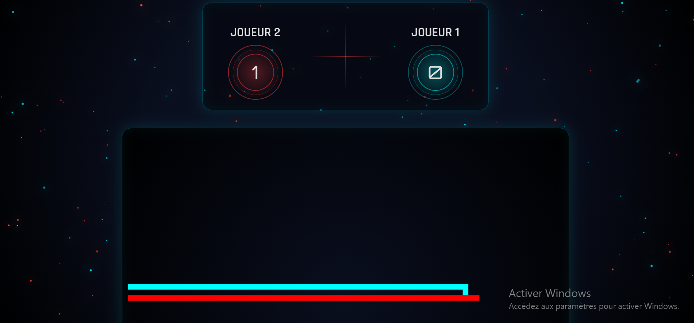

# 🕹️ Tron Game

## 📌 Description
Jeu Tron développé en HTML, CSS et JavaScript.  
Deux joueurs s’affrontent en se déplaçant sur une grille et doivent éviter les collisions.

---

## ⚙️ Technologies utilisées
- HTML5
- CSS3
- JavaScript (Vanilla JS)

---

## 🎮 Fonctionnalités
- Jeu à 2 joueurs sur le même clavier
- Déplacement en temps réel
- Détection des collisions
- Gestion des conditions de victoire

---

## 🚀 Lancer le projet
Il suffit d’ouvrir le fichier `index.html` dans un navigateur.

---

## 🖼️ Aperçu du jeu

### Gameplay

### Écran de victoire

## 👤 Auteurs
Rayan Derguini
Massiva Aliouat
